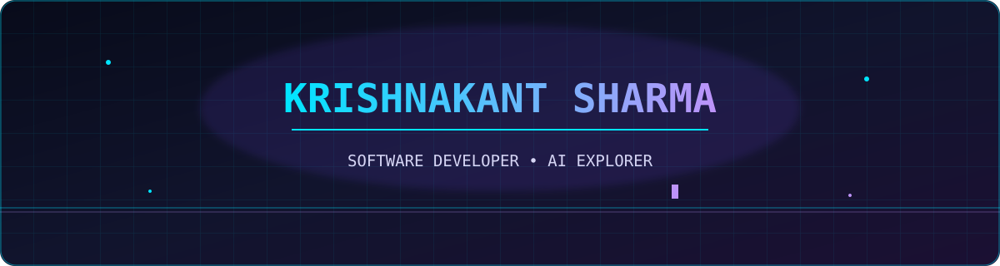
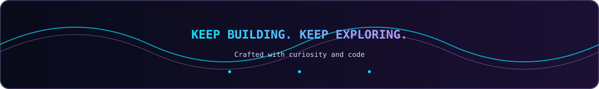

<!-- ===================== HEADER ===================== -->

<div align="center">




</div>

<br/>

<!-- ===================== ABOUT ME ===================== -->

## `> whoami`

<table>
<tr>
<td width="60%" valign="top">

```typescript
const krishnakant = {
    name: "Krishnakant Sharma",
    username: "KrishnaKant333",
    role: "Computer Science Student & Developer",

    focus: [
        "Full Stack Development",
        "Software Engineering",
        "Artificial Intelligence",
        "DevOps"
    ],

    currentlyLearning: [
        "Advanced Backend Development",
        "Cloud Technologies",
        "Machine Learning",
        "System Design"
    ],

    mindset: "Learn. Build. Improve. Repeat."
};
```

</td>

<td width="40%" valign="middle">

### `> mission`

Building practical software solutions and exploring how technology can solve real-world problems.

<br/>

- Building full-stack applications
- Learning backend architecture
- Exploring AI-powered systems
- Improving problem-solving skills
- Experimenting with emerging technologies

</td>
</tr>
</table>

<br/>

<!-- ===================== TECH STACK ===================== -->

## `> technology_stack`

<div align="center">

### Languages


### Frontend


### Backend & Databases


### Tools & Platforms


</div>

<br/>

<!-- ===================== PROJECTS ===================== -->

## `> featured_projects`

<table>
<tr>
<td width="50%" valign="top">

<h3 align="center">ShelfLife</h3>

<div align="center">

<a href="https://github.com/KrishnaKant333/ShelfLife">

</a>

</div>

<br/>

An inventory intelligence platform designed to help businesses manage products, monitor expiry dates, reduce waste, and improve stock visibility.

**Key Features**

- Inventory management
- Expiry tracking
- Low-stock monitoring
- OCR-based information extraction
- Waste analytics
- Business-focused dashboard

**Technologies**

`Next.js` `TypeScript` `Tailwind CSS` `PostgreSQL` `Prisma`

</td>

<td width="50%" valign="top">

<h3 align="center">NextTask</h3>

<div align="center">

<a href="https://github.com/KrishnaKant333/NextTask">

</a>

</div>

<br/>

A full-stack task management application built to practice frontend development, REST APIs, database operations, and CRUD functionality.

**Key Features**

- Create tasks
- Update tasks
- Delete tasks
- Mark tasks as completed
- REST API integration
- MongoDB database

**Technologies**

`React` `Node.js` `Express` `MongoDB` `Axios`

</td>
</tr>
</table>

<br/>

<!-- ===================== CURRENT FOCUS ===================== -->

## `> current_focus`

<table>
<tr>
<td width="50%" valign="top">

### `01` Full Stack Development

Building real-world applications using modern frontend and backend technologies.

</td>

<td width="50%" valign="top">

### `02` Backend Engineering

Learning REST APIs, database architecture, and server-side development.

</td>
</tr>

<tr>
<td width="50%" valign="top">

### `03` DevOps

Exploring deployment workflows, cloud platforms, and infrastructure fundamentals.

</td>

<td width="50%" valign="top">

### `04` Artificial Intelligence

Exploring machine learning and AI-powered software systems.

</td>
</tr>

<tr>
<td width="50%" valign="top">

### `05` System Design

Understanding scalable and maintainable software architecture.

</td>

<td width="50%" valign="top">

### `06` Continuous Learning

Improving technical skills through projects, experimentation, and problem solving.

</td>
</tr>
</table>

<br/>


<!-- ===================== GITHUB ACTIVITY ===================== -->

## `> github_activity`

<div align="center">

<a href="https://github.com/KrishnaKant333">


</a>

<a href="https://github.com/KrishnaKant333">


</a>

</div>

<br/>

<!-- ===================== CONTRIBUTION STREAK ===================== -->

## `> contribution_streak`

<div align="center">


</div>

<br/>

<!-- ===================== CONTRIBUTION SNAKE ===================== -->

## `> contribution_map`

<div align="center">


</div>

<br/>


<!-- ===================== CONNECT ===================== -->

## `> connect_with_me`

<div align="center">

<a href="https://github.com/KrishnaKant333">

</a>

<a href="https://www.linkedin.com/in/krishnakant-s-sharma">

</a>

<a href="mailto:krishnaksharma.official@gmail.com">

</a>

</div>

<br/>

<!-- ===================== FOOTER ===================== -->

<div align="center">
    


</div>
